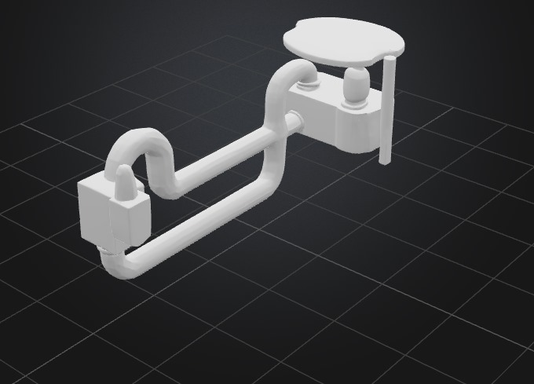

# Total Time Spent: 102 hours

---

## Day 1 – 14/6/2025 – 6 hours  
Held a brainstorming session with the team to finalize the core architecture of the system: two containers, one for sensing and dosing, the other for chemical treatment and filtration. Created a rough whiteboard diagram showing the water path, sensor placement, and logical flow. Read two papers on the effectiveness of H₂O₂ for microbial disinfection and began researching proper dosing ranges for 1-liter batches.

---

## Day 2 – 15/6/2025 – 5 hours  
Started designing Container 1 in Fusion 360. Integrated a modular top lid for easy sensor placement and created mounting holes for the pH and turbidity sensors. Simulated the fit of a standard peristaltic pump inlet tube and added a dosing port for hydrogen peroxide injection. Also calculated the internal volume to ensure it holds a minimum of 2 liters with 10% overflow margin.

---

## Day 3 – 16/6/2025 – 6 hours  
Worked on the 3D model of Container 2, which is more complex due to the chemical addition and mixing steps. Designed a cylindrical slot for a servo-controlled chemical tray with four compartments (for alum or lime). Added a vertical shaft for a stirring paddle powered by the same servo. Confirmed the volume needed for effective mixing and adjusted side walls to prevent splashing during agitation.

---

## Day 4 – 17/6/2025 – 5 hours  
Imported the Fusion 360 models into SolidWorks to perform basic flow analysis. Simulated gravity-based flow from Container 1 to Container 2 using a valve-controlled outlet. Adjusted the diameter of the connecting pipe from 8mm to 12mm to reduce back-pressure. Identified a dead zone in mixing and redesigned the paddle to a 3-arm fan type. Documented all changes with versioned exports.

---

## Day 5 – 18/6/2025 – 5 hours  
Rendered high-resolution images of the full assembly. Created exploded diagrams to explain the chemical dropper mechanism and sensor modules. Exported STL files and shared them with the team for early feedback. Spent the rest of the time researching sensor calibration protocols, especially for pH probes using SparkFun’s analog circuit.

---

## Day 6 – 19/6/2025 – 6 hours  
Deep-dived into peristaltic pump options. Compared 7 models online and selected the Yanmis 19–120 mL/min dual-head type. It fits our flow rate perfectly for controlled chemical injection. Created a 3D placeholder model for it and inserted it into the Container 1 mount. Designed and printed a PLA pump base for testing fit.

---

## Day 7 – 20/6/2025 – 4 hours  
Sketched the full wiring layout using Fritzing. The layout includes the Arduino Due, pH sensor circuit, turbidity sensor, servo motor, peristaltic pump, and power supply. Verified voltage requirements. Built a breadboard mock-up of the pH circuit and tested stability using vinegar, tap water, and baking soda solutions.

---

## Day 8 – 21/6/2025 – 4 hours  
Started Arduino programming. Developed the main control loop: measure → dose peroxide → transfer water → mix → remeasure. Initialized libraries for servo and analog readings. Simulated timing delays and fail-safes (max 3 chemical cycles before alarm). Logged sensor data over Serial Monitor for debugging.

---

## Day 9 – 22/6/2025 – 5 hours  
Wrote a modular PID control algorithm to adjust chemical quantities based on pH and turbidity readings. Created lookup tables for alum and lime dosages across pH ranges. Simulated 5 test cycles with mock readings to test the reaction loop. Debugged a servo rotation overshoot bug and fixed timing via `delayMicroseconds()`.

---

## Day 10 – 23/6/2025 – 4 hours  
Focused on visual documentation. Added clear labels to Fritzing diagrams, showing jumper color codes and voltage lines. Exported the full circuit diagram as a PNG. Built a cardboard prototype box to test component spacing. Adjusted container positioning for better balance and tubing alignment.

---

## Day 11 – 24/6/2025 – 4 hours  
Researched best practices for activated carbon filtration. Chose a combination of gravel (lower layer) and carbon (upper layer) in a 3D-printed mesh tube. Modeled the filter in Fusion 360 and added it to the outflow pipe of Container 2. Created an accessible filter cap so users can replace the media.

---

## Day 12 – 25/6/2025 – 5 hours  
Tested pH sensor response and accuracy. Built a calibration curve using known buffer solutions: pH 4, pH 7, and pH 10. Logged voltage changes every 10s and graphed them in Excel. Validated consistency over 3 runs and documented a ±0.2pH margin of error. Updated the Arduino sketch with calibration values.

---

## Day 13 – 26/6/2025 – 5 hours  
Began working on the README. Added key sections: problem statement, inspiration, how the system works, and features. Inserted project renders and labeled the stages of water purification. Cross-checked component names and prices from receipts and vendor sites to start building the BOM.

---

## Day 14 – 27/6/2025 – 6 hours  
Built safety features into the system code:  
- Max 3 mL H₂O₂ per liter  
- Emergency drain button support  
- pH warning range buzzer

Printed and installed the servo tray, tested drop accuracy using alum powder. Cleaned up unused wiring and added zip ties for neatness.

---

## Day 15 – 28/6/2025 – 6 hours  
Analyzed power requirements. Used a USB multimeter to log current draw across different scenarios: idle, full pump run, servo mixing, and sensor reads. Peak usage was 1.24A at 5V during combined pump + servo action. Decided on using a 2A external adapter for safety.

---

## Day 16 – 29/6/2025 – 5 hours  
Finalized the 3D enclosures. Added mounting tabs and waterproof gasket channels. Designed the sensor holes to include silicone sealing rings. Uploaded all .STL and .F3D files to the GitHub `/src` folder. Took beauty shots of the assembled unit for documentation.

---

## Day 17 – 30/6/2025 – 4 hours  
Finished wiring and tested the system for full-cycle automation. Observed 5 purification runs using different water types (dirty tap water, muddy water, soap-contaminated). Each cycle took 7–9 minutes. Logged sensor output and adjusted pump runtime dynamically.

---

## Day 18 – 1/7/2025 – 4 hours  
Finished the STL model,  and README. Cross-checked BOM links and captured missing photos.

---

## Day 19 – 2/7/2025 – 3 hours  
Narrated the explanation of the Arduino logic and chemical dosing. Also created a short timelapse showing the 3D print of the paddle stirrer.

---

## Day 20 – 3/7/2025 – 3 hours  
Integrated all data into the README. Added BOM table. Edited markdown layout to be readable on mobile and desktop. Final proofread of all grammar and headers. Added collapsible sections for readability.

---

## Day 21 – 4/7/2025 – 4 hours  
Wrote the final project abstract. Tied together engineering, chemistry, and sustainability rationale. Created a flowchart summarizing the full logic system.

---

## Day 22 – 5/7/2025 – 3 hours  
Final review before submission. Ran a full dry test with no chemicals to ensure logic was stable. Confirmed the GitHub repo includes:  
- README ✅  
- JOURNAL ✅  
- BOM ✅  
- Wiring diagram ✅  
- STL file ✅  
- Images ✅  
Project is officially complete.

---
## Images
-    
- 
- 
- .png>)
### Expected results
- 
- 
- 
- 
### Chemical Equations brought up after balancing and used
- 
- 
- 
- 
- 