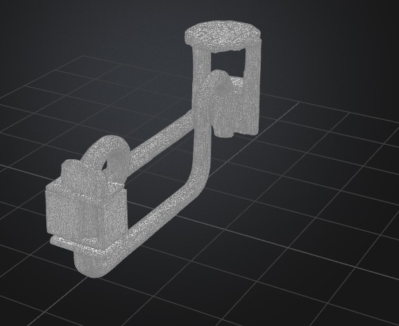
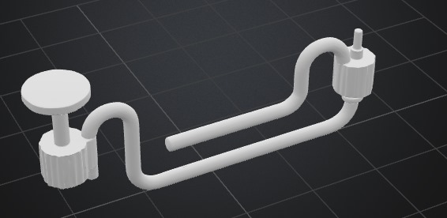

# Kurin Flow 

An intelligent dual-container water purification system that simulates real-world chemical filtration with minimal human intervention.

---

##  Why I Made This

In many developing communities, water purification is either manual or expensive. I wanted to build a **low-maintenance, auto-correcting system** that mimics industrial purification steps using affordable electronics and chemistry.

Kurin Flow cycles contaminated water through sensor-guided pH/turbidity detection, H₂O₂ sterilization, and lime/alum treatment before filtering it back into a clean tank. The system repeats until the water meets preset purity thresholds.

---

## 🛠 How It Works

- **Container 1**: Holds incoming water, measures pH/TDS/turbidity, and doses H₂O₂ using a peristaltic pump.
- **Container 2**: Adds lime or alum via a servo-controlled chemical tray. Water is mixed, filtered (gravel + carbon), and returned.
- **Arduino Due**: Reads sensors and controls logic. Repeats purification up to 5 cycles, adjusting based on readings.

---

##  Project Images

- .png>) 
-  
-  
- 

---

##  Components Used

| Component | Purpose | Price | Link |
|----------|---------|--------|------|
| Arduino Due | Central controller | $61 | [Arduino Store](https://store.arduino.cc/products/arduino-due) |
| pH Sensor + Probe | Acidity/alkalinity | $45 | [DFRobot](https://www.dfrobot.com/product-1782.html) |
| Turbidity Sensor | Water clarity | $18 | [Fut Electronics](https://store.fut-electronics.com/products/copy-of-turbidity-sensor-water-suspended-particles-china) |
| Peristaltic Pump | Moves fluids | $95 | [Ubuy Egypt](https://www.ubuy.com.eg/en/product/OTNAE94-yanmis-high-flow-peristaltic-pump...) |
| Servo Motor (40kg·cm) | Chemical dispenser & mixing | $25 | Amazon/local |
| SparkFun pH Circuit | Sensor calibration | $45 | [SparkFun](https://www.sparkfun.com/products/12615) |

---

##  Bill of Materials (Table Format)

| Part | Quantity | Unit Price | Total | Link |
|------|----------|------------|-------|------|
| Arduino Due | 1 | $61 | $61 | [Link](https://store.arduino.cc/products/arduino-due) |
| pH Sensor + Probe | 1 | $45 | $45 | [Link](https://www.dfrobot.com/product-1782.html) |
| Turbidity Sensor | 1 | $18 | $18 | [Link](https://store.fut-electronics.com/products/copy-of-turbidity-sensor-water-suspended-particles-china) |
| Peristaltic Pump | 1 | $95 | $95 | [Link](https://www.ubuy.com.eg/en/product/OTNAE94-yanmis-high-flow-peristaltic-pump...) |
| Servo Motor | 1 | $25 | $25 | Amazon |
| pH Circuit Board | 1 | $45 | $45 | [Link](https://www.sparkfun.com/products/12615) |

**Total: $289**

---

